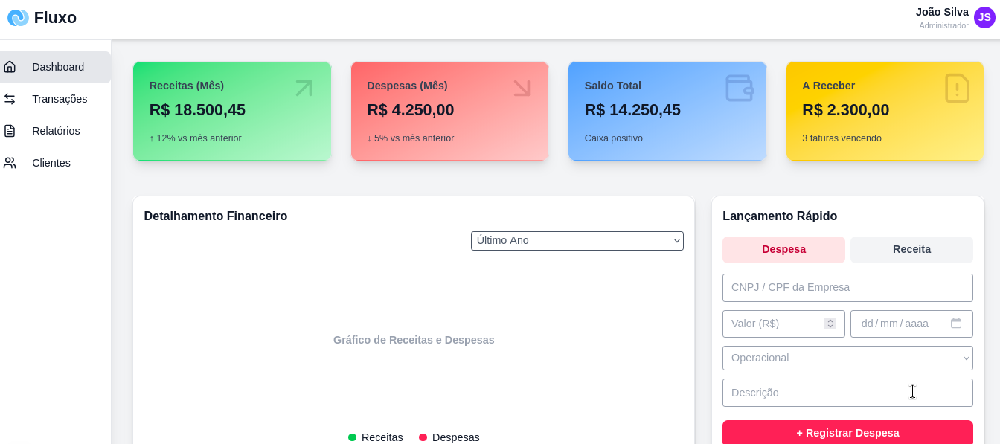

<div align="center">
  
  <h1>💸 Fluxo</h1>
  <p>
    
    
    
    
  </p>
</div>


**Fluxo** é um aplicativo financeiro moderno, modular, responsivo e intuitivo, desenvolvido com Next.js, React 19, Tailwind CSS e shadcn/ui. O objetivo é facilitar o controle de receitas, despesas, saldo e relatórios financeiros de forma visual e prática.
O aplicativo pode ser extendido com módulos para a necessidade do usuário. 

<div align="center">
   
</div>

---

## ✨ Funcionalidades

- **Dashboard Resumido:** Cards com receitas, despesas, saldo e valores a receber, com indicadores de variação.
- **Gráfico Financeiro:** Visualização de receitas e despesas por período.
- **Lançamento Rápido:** Formulário para adicionar receitas ou despesas de forma ágil.
- **Tabela de Últimos Lançamentos:** Visualização dos lançamentos mais recentes, com status e categorias.
- **Relatórios Financeiros:** Geração de relatórios detalhados e exportação em PDF.
- **Navegação Lateral:** Sidebar responsiva com destaque para a página atual.
- **Novo Ícone:** Logo SVG exclusivo na interface e README.
- **Design Responsivo:** Layout adaptado para desktop e mobile, com experiência fluida.


---

## 🚀 Tecnologias Utilizadas

- [Next.js 16](https://nextjs.org/)
- [React 19](https://react.dev/)
- [Tailwind CSS 4](https://tailwindcss.com/)
- [shadcn/ui](https://ui.shadcn.com/) (componentes e estilização)
- [Lucide React](https://lucide.dev/) (ícones)
- [jsPDF](https://github.com/parallax/jsPDF) (exportação de relatórios em PDF)
- TypeScript

---

## 📦 Instalação

1. **Clone o repositório:**

   ```bash
   git clone https://github.com/phaleixo/fluxo.git
   cd fluxo
   ```

2. **Instale as dependências:**

   ```bash
   npm install
   # ou
   yarn install
   ```

3. **Inicie o servidor de desenvolvimento:**

   ```bash
   npm run dev
   # ou
   yarn dev
   ```

4. **Acesse:**  
   [http://localhost:3000](http://localhost:3000)

---

## 🗂️ Estrutura de Pastas

```
app/
	components/
		DashboardCards.tsx
		FinancialDetailsChart.tsx
		Header.tsx
		QuickEntryForm.tsx
		RecentEntriesTable.tsx
		Sidebar.tsx
	financialReport/
		page.tsx
	transaction/
		page.tsx
	globals.css
	layout.tsx
	page.tsx
public/
```

---

## 🖥️ Principais Componentes

- **DashboardCards:** Cards de resumo financeiro.
- **FinancialDetailsChart:** Gráfico de receitas/despesas.
- **QuickEntryForm:** Formulário de lançamento rápido.
- **RecentEntriesTable:** Tabela de lançamentos recentes.
- **Sidebar:** Menu lateral de navegação com destaque da página ativa.
- **Header:** Cabeçalho com logo SVG, nome do app e usuário.

---

## 📊 Relatórios

- Acesse a página de relatórios para visualizar e exportar o relatório financeiro em PDF.
- Filtros de período disponíveis para análise personalizada.

---

## 🛠️ Scripts Disponíveis

- `npm run dev` — Inicia o servidor de desenvolvimento.
- `npm run build` — Gera a build de produção.
- `npm start` — Inicia o app em modo produção.
- `npm run lint` — Executa o linter.

---

## 📄 Licença

Este projeto está sob a licença MIT.

---

## 🙋‍♂️ Contribuição

Contribuições são bem-vindas! Sinta-se à vontade para abrir issues ou pull requests.
